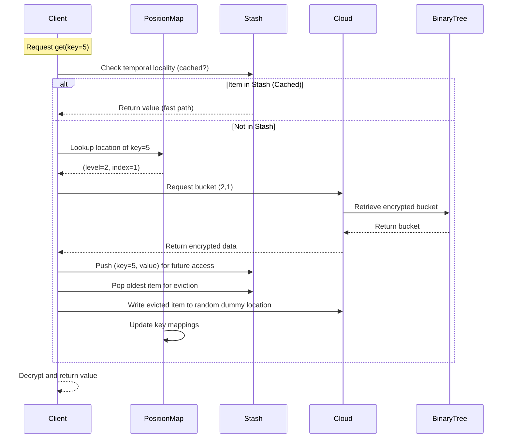

# Mobile Cloud Storage (MCS) System

A secure and privacy-preserving cloud storage system based on the paper:  
**"Enabling Efficient, Secure and Privacy-Preserving Mobile Cloud Storage"** (IEEE TDSC 2022).

## Features
- **Data Confidentiality**: Encrypted storage using Damgård-Jurik cryptosystem.
- **Access Pattern Privacy**: Oblivious retrieval/update via `Stash` and `BinaryTree`.
- **Temporal Locality**: Caching for frequently accessed items.
- **Verification Chunks**: Integrity checks against malicious clouds.

## Components
| Module          | Description                               |
|-----------------|-------------------------------------------|
| `core.py`       | Core (Stash, PositionMap, BinaryTree)     |
| `cloud.py`      | Mobile Cloud Client or Storage            |
| `damgard_jurik` | Homomorphic encryption (External Library) |
| `main.py`       | Example usage                             |

## Example Workflow: `get(key=5)`

### Step-by-Step Process


## How to Run
```bash
  python demo.py
```